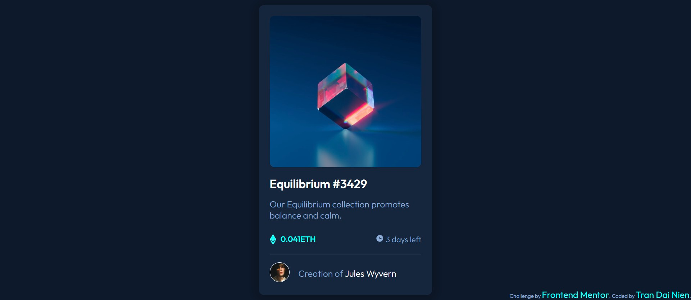

# Frontend Mentor - NFT preview card component solution

This is a solution to the [NFT preview card component challenge on Frontend Mentor](https://www.frontendmentor.io/challenges/nft-preview-card-component-SbdUL_w0U). Frontend Mentor challenges help you improve your coding skills by building realistic projects. 

## Table of contents

- [Overview](#overview)
  - [The challenge](#the-challenge)
  - [Screenshot](#screenshot)
  - [Links](#links)
- [My process](#my-process)
  - [Built with](#built-with)
  - [What I learned](#what-i-learned)
  - [Feedbacks](#Feedbacks)
- [Author](#author)
- [Acknowledgments](#acknowledgments)


## Overview

### The challenge

Users should be able to:

- View the optimal layout depending on their device's screen size
- See hover states for interactive elements

### Screenshot



### Links

- Solution URL: [Add solution URL here](https://github.com/NienDev/NFT-preview-card.git)
- Live Site URL: [Add live site URL here](https://niendev.github.io/NFT-preview-card/)

## My process

### Built with

- HTML
- CSS

### What I learned  

- Using picture to display image related to the screen size

```html
<picture>
        <a href="#" class="thumbnail"
          ></a>
</picture>
```
### Feedbacks
- Change the Equilibrium anchor a tag, to an h1, if you want to keep your a tag, nest the h1 on it, cause your document always need an h1 tag!
- Don't use the <picture> tag unless you are gonna render different images with srcset, instead of that you can just nest your img inside the a and the pseudoelements!
- <--- From [David](https://www.frontendmentor.io/profile/DavidMorgade) --->

## Author

- Website - [Tran Dai Nien](https://www.facebook.com/trandainien)
- Frontend Mentor - [@trandainien](https://www.frontendmentor.io/profile/trandainien)
- Twitter - [@DaiNienn](https://twitter.com/DaiNienn)

## Acknowledgments

Big thank to Frontend Mentor as well as all helpful comments from people around the world
